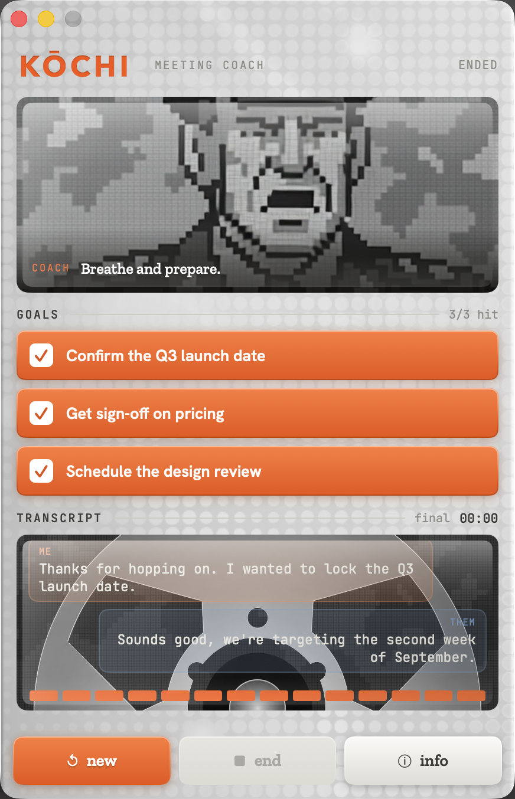
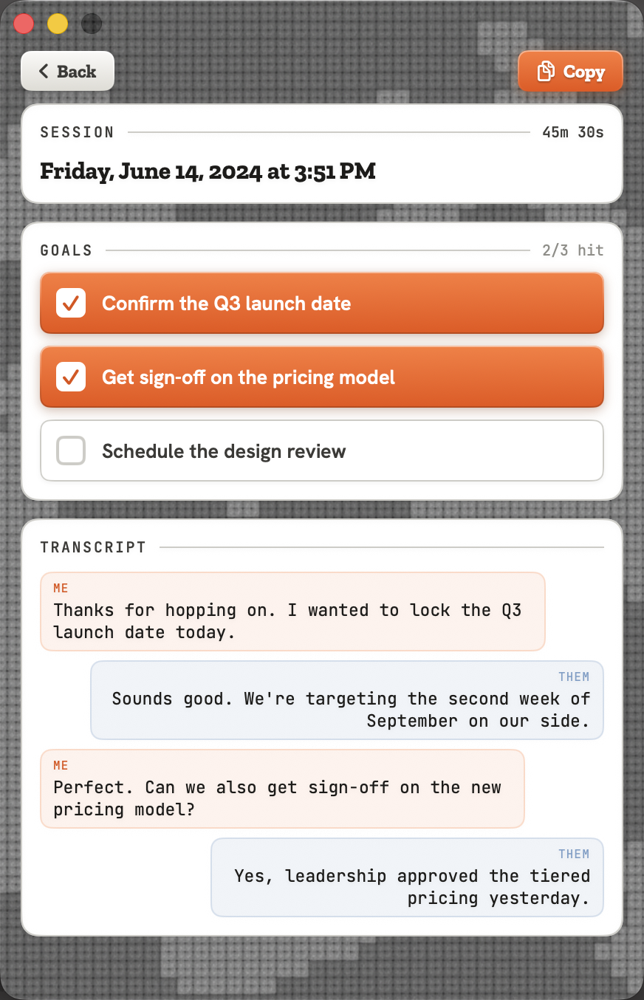
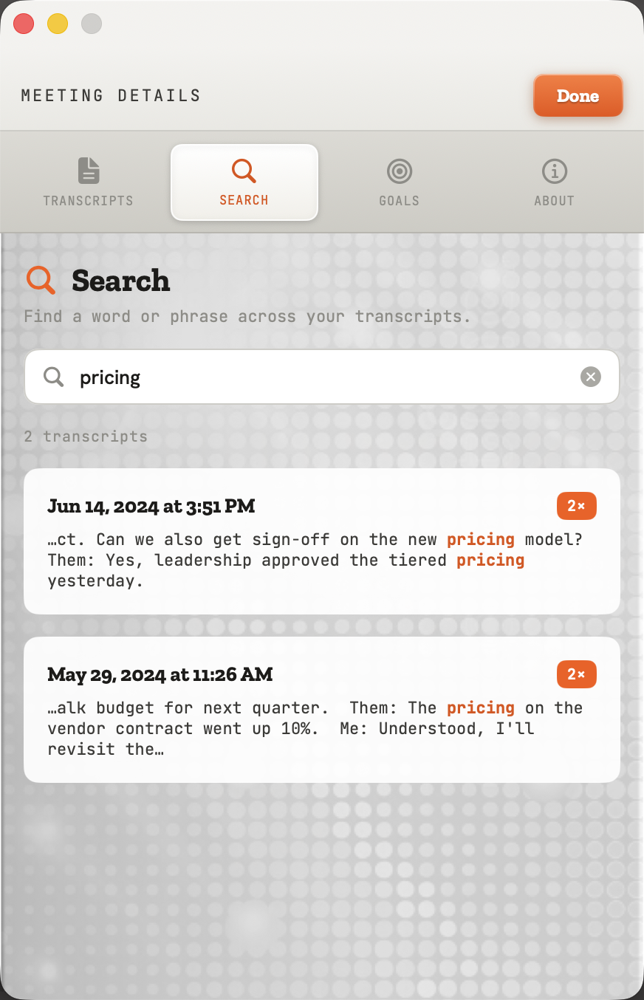

# Kōchi

**A private, on-device meeting companion for Mac — a local alternative to cloud notetakers like Granola.**

Kōchi listens to your meetings, transcribes both sides of the conversation,
tracks your goals, and coaches you in real time — and it does **all of it on your
Mac**. No cloud, no account, no subscription, and **your audio never leaves your
device**. Optionally, you can add your own Claude or OpenAI API key for a deeper
written meeting analysis — that's the one feature that sends anything out, it's
off by default, and it sends only the text transcript (never your audio).

It runs as a compact Mac app with a **menu-bar icon** you can click to bring it
to the front whenever you need it. Built entirely in SwiftUI, native to macOS.

> [!IMPORTANT]
> **Requires macOS 27, which is currently in developer beta (mid-2026).**
> Kōchi's on-device coaching and goal analysis run on Apple's new
> **Foundation Models** framework, which ships only in macOS 27. Until macOS 27
> reaches public release, you'll need the beta OS (and a matching Xcode/SDK) to
> build and run the app.

<p align="center">
  
  &nbsp;
  
  &nbsp;
  
</p>
<p align="center"><sub>Live coaching & goal tracking · saved meeting detail · search across transcripts</sub></p>

### Watch the tutorial

<p align="center">
  <a href="https://youtube.com/shorts/eApAqi_FtKY">
    
  </a>
</p>
<p align="center"><sub>▶ <a href="https://youtube.com/shorts/eApAqi_FtKY">Watch the tutorial on YouTube</a></sub></p>

---

## Why Kōchi instead of a cloud notetaker?

Tools like Granola are great, but they send your meeting audio and transcripts
to the cloud and run on a subscription. Kōchi makes the opposite trade:
everything is local.

|                         | Kōchi                          | Typical cloud notetaker |
| ----------------------- | ------------------------------ | ----------------------- |
| Transcription           | On-device (Apple Speech)       | Cloud servers           |
| AI notes / coaching     | On-device (Apple Intelligence) | Cloud LLM               |
| Deeper AI analysis      | Optional — your own API key, off by default | Always on the cloud |
| Your audio leaves the Mac? | **Never**                   | Yes                     |
| Account / sign-in       | None                           | Required                |
| Price                   | Free, open source (MIT)        | Subscription            |
| Works offline           | **Yes**                        | No                      |

If privacy, cost, or working on a plane matter to you, Kōchi is for you.

---

## What it does

- **Captures both sides of a call.** Your microphone is labelled `Me:` and the
  far side (system audio, via ScreenCaptureKit) is labelled `Them:`, so the
  transcript reads like a real conversation.
- **Transcribes on-device** with Apple's Speech framework — live, and offline.
- **Tracks up to three goals per meeting.** Apple's on-device model marks a goal
  as hit when the conversation covers it, and you can tap any goal to override it
  yourself.
- **Set goals by voice.** On the Goals page, tap **Speak New Goals**, say what you
  want to focus on, and Apple's on-device model turns it into up to three short
  goals — no typing. Goals are per-meeting (changing them never alters past
  meetings), starting from a reusable saved set.
- **Coaches you live** with a coach video and prompts that respond to how the
  meeting is going.
- **Saves every session locally** — transcript, goals, and a mixed mic + system
  audio recording (`.m4a`).
- **Search** across all your past transcripts and jump straight to a meeting.
- **Optional: deeper AI analysis (bring your own key).** Add a personal Claude or
  OpenAI API key to turn a finished meeting's transcript into a written summary,
  action items with owners, and an honest A–F effectiveness review (communication,
  focus, professionalism) — plus an auto-suggested meeting name you can edit. It's
  off until you add a key, runs only when you click **Run AI Analysis**, sends only
  the transcript text, saves an `analysis.md` with the meeting, and records the
  token usage and an estimated cost for each run.

---

## Requirements

Kōchi runs Apple's newest on-device models, so it needs current hardware and OS:

- An **Apple-silicon Mac** (M1 or later) with **Apple Intelligence** enabled.
- **macOS 27** — currently in **developer beta** (mid-2026), not yet public
  release. The on-device coaching and goal analysis use Apple's new
  **Foundation Models** framework (`import FoundationModels`), which is only
  available on macOS 27, so the app targets that version.
- **Xcode** with the macOS 27 beta SDK.

You can either **download a prebuilt build** or **build it from source** in
Xcode (a few minutes).

---

## Download

Grab the latest build from the
[**Releases**](https://github.com/jjanisheck/Kochi/releases/latest) page, unzip
it, and drag **Kochi.app** to your Applications folder.

> [!NOTE]
> The build is signed for development, **not notarized** for distribution, so
> macOS Gatekeeper will block it on first launch. To open it anyway:
> right-click **Kochi.app → Open**, or run
> `xattr -dr com.apple.quarantine /Applications/Kochi.app`.
> And remember it only runs on **macOS 27** (developer beta).

No release published yet? Build from source below.

---

## Get started

### 1. Clone and open

```bash
git clone <your-repo-url>
cd <repo>/app
open Kochi.xcodeproj
```

### 2. Set your signing team

Because macOS apps must be signed:

1. In Xcode, select the **KochiApp** target → **Signing & Capabilities**.
2. Pick your **Team** (your free Apple ID works).
3. Change the **Bundle Identifier** to something of your own, e.g.
   `com.yourname.kochi`.

### 3. Run

- Choose the **KochiApp** scheme and **My Mac** as the destination, then press
  **▶︎ Run**.
- Kōchi opens its window and shows up in the Dock. There's also a **menu-bar
  icon** — click it any time to bring the window to the front (it reopens a
  window if you've closed it).

Prefer the command line?

```bash
cd app
xcodebuild -project Kochi.xcodeproj -scheme KochiApp -destination 'platform=macOS' build
```

### 4. Grant permissions (first run)

Kōchi asks for three permissions the first time you record:

- **Microphone** — your side of the conversation.
- **Speech Recognition** — on-device transcription.
- **Screen Recording** — required by macOS to capture the *other* side's audio
  (system audio). Kōchi doesn't record your screen.

---

## How to use it

1. Click the **menu-bar icon** to bring Kōchi to the front.
2. Type up to **three goals** for the meeting (e.g. "Confirm the launch date").
3. Hit **Start** — Kōchi transcribes both sides live and watches for your goals.
   Tap any goal to mark it hit yourself if you want to override the AI.
4. Hit **End** when you're done. The session is saved.
5. Open **Settings → Transcripts** to revisit any meeting, or **Search** to find
   a word across all of them.

---

## Privacy

By default, everything — transcription, goal analysis, live coaching, and saved
recordings — runs on-device with Apple's frameworks, and nothing leaves your Mac.

The **optional AI Analysis** feature is the single exception. If you add your own
Claude or OpenAI API key and tap **Run AI Analysis** on a meeting, Kōchi sends that
meeting's **text transcript** to the provider you chose to generate the written
analysis. Your **audio is never sent**, the key is stored in the macOS Keychain, and
nothing is sent unless you opt in by adding a key and running the analysis yourself.

## Building & contributing

The whole project lives under `app/` and has **no third-party dependencies** —
Apple frameworks only (no Swift Package or CocoaPods). Match the surrounding
SwiftUI style, and keep both platforms compiling: cross-platform code is gated
with `#if os(macOS)` / `#if os(iOS)`.

### Build & test

```bash
cd app

# Build macOS
xcodebuild -project Kochi.xcodeproj -scheme KochiApp -destination 'platform=macOS' build

# Tests
xcodebuild -project Kochi.xcodeproj -scheme KochiApp -destination 'platform=macOS' test
```

Always confirm the macOS build succeeds before committing, and don't commit
secrets or build artifacts (`DerivedData/`, `.build/`).

### Building a signed release

The app builds with **Hardened Runtime** enabled (required for notarization). Its
entitlements (`KochiApp/Kochi.entitlements`) cover everything it needs —
microphone, network (for the optional cloud analysis), user-selected files, and
the sandbox; ScreenCaptureKit needs no entitlement.

To produce a notarized build that opens cleanly on any Mac, you need a paid Apple
Developer account with a *Developer ID Application* certificate:

1. In Xcode: scheme **KochiApp**, destination **Any Mac** → **Product → Archive**.
2. In the Organizer: **Distribute App → Direct Distribution** — Xcode signs with
   Developer ID and submits to Apple for notarization automatically.
3. When notarization finishes, **Export** the `.app`, zip it, and attach it to a
   GitHub Release.

A plain `xcodebuild … build` (or Run in Xcode) is signed for your own machine and
doesn't need notarization.

### Project layout

- **`KochiApp.swift`** — app entry. A regular windowed app (Dock icon + window)
  with a menu-bar status item whose icon brings the window to the front,
  reopening one if every window was closed.
- **`ContentView.swift`** — home screen: coach video, goals, live transcript.
  `GoalRow` is the goal bar (tap to toggle hit). Phases: `.pre / .live / .ended`.
- **`Views/SettingsView.swift`** — settings panel (Transcripts · Search · Goals ·
  AI · About) plus `MeetingDetailView`, presented as a full-panel overlay.
- **`Managers/`** — `AudioManager`, `TranscriptionManager`, `GoalManager`,
  `LLMManager` (Foundation Models, gated by `@available`), `ThemeManager`,
  `CloudAnalysisManager` (optional cloud AI analysis).
- **`Services/`** — `DualTranscriptionEngine`, `SystemAudioCapture`,
  `MixedAudioRecorder`, `FileTranscriber`, `GoalDictationService` (voice goal
  entry), `KeychainStore`, and `CloudLLM/` (`AnthropicClient`, `OpenAIClient`)
  for the opt-in analysis.
- **`AudioTapShim.{h,m}` + `Kochi-Bridging-Header.h`** — the project's only
  Objective-C: a tiny category that wraps the audio `installTap` (deprecated on
  macOS 27 but still functional) so the unusable refined replacement's deprecation
  stays out of the Swift build. Remove once Apple ships a usable Swift overlay.
- **Design system — `KochiDeviceStyle.swift`** — `KColor`, `KFont` (Zilla Slab /
  JetBrains Mono / Hanken Grotesk), `kCard()`, `SlabLabel`, `BeveledKeyStyle`,
  `ChatTranscriptView`. Reuse these instead of system fonts and colors.

## License

[MIT](LICENSE) © 2026 Joey Janisheck. Free to use, modify, and distribute —
just keep the copyright notice.
