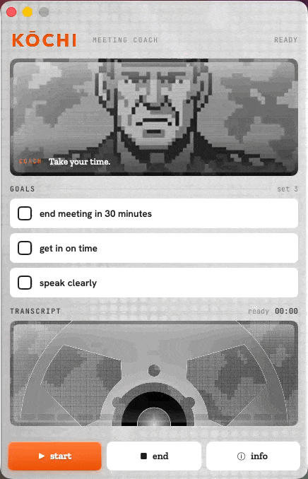
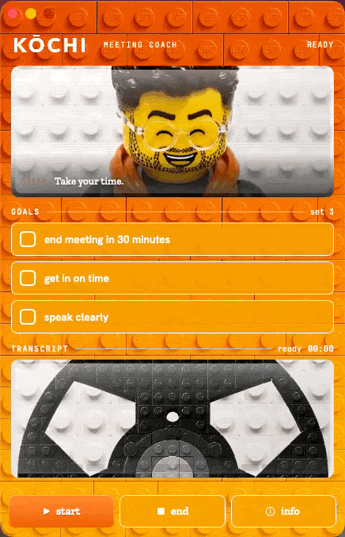
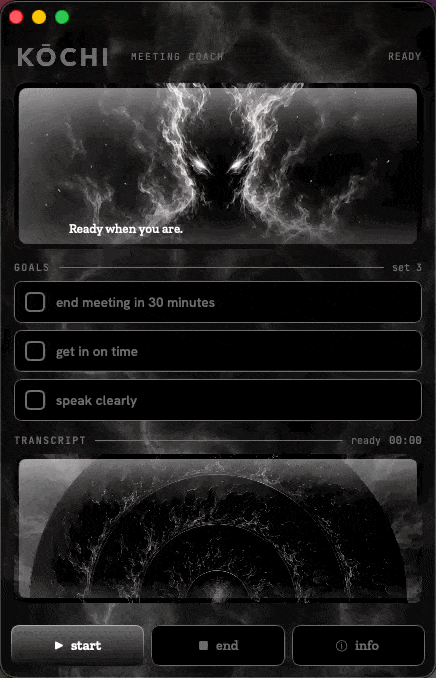

# Creating a Kōchi Theme

> **A love letter to WinAmp.** It really whipped the llama's ass — and the best
> thing about it was the skins. Anyone could reskin the whole player with a folder
> of art and a text file, and suddenly it was *yours*. Kōchi themes work the same
> way: a folder of art + one JSON file reskins the entire app — palette,
> background, the spinning reel, even the coaching character. No code, no Xcode
> wrangling. This guide walks you through making one from scratch.
>
> Today it's a folder and a JSON file. **The goal is to make this fully automated**
> — describe a vibe, get a theme. Until then, here's the manual path, and it's
> genuinely easy.

---

## The built-in themes

The five themes that ship today — each is just a folder you can copy and riff on.

<table>
  <tr>
    <td align="center"><br><b>default</b><br><sub>warm / orange</sub></td>
    <td align="center"><br><b>bricks</b><br><sub>terracotta</sub></td>
    <td align="center"><br><b>hero</b><br><sub>red·white·blue</sub></td>
    <td align="center"><br><b>noir</b><br><sub>dark / mono</sub></td>
    <td align="center"><br><b>zen</b><br><sub>calm / green</sub></td>
  </tr>
</table>

---

## What a theme is

Every theme is a single folder under
[`app/KochiApp/Resources/Themes/`](../app/KochiApp/Resources/Themes). The folder
name **is** the theme's id. Drop a valid folder in, rebuild, and it shows up in
**Settings → About → THEMES** automatically — `Resources/Themes/` is one Xcode
folder reference, so there are no project or code changes to make.

```
app/KochiApp/Resources/Themes/<your-theme>/
  theme.json                      ← palette + options (the "skin file")
  images/
    theme.png                     ← swatch shown in the theme picker
    BackgroundImage.png           ← full home-screen background
    BackgroundPlainImage.png      ← texture behind the reel + settings/detail
    FilmReel.png                  ← the spinning transcript reel
    KochiLogo.png                 ← the brand wordmark
  videos/
    idle-1.mp4 … idle-4.mp4       ← the resting coach loop (required)
    goal-1.mp4 … wrap-4.mp4       ← the other coaching moments (optional)
```

A theme **fails to load** (and is skipped) if `theme.json` is missing or any
**required color** is absent — that's deliberate, so a half-built theme surfaces
loudly instead of shipping broken. Everything else has a sensible default.

---

## The 6 steps

1. [Copy a starter folder](#step-1--copy-a-starter-folder)
2. [Make the art](#step-2--make-the-art) — `theme.png`, `BackgroundImage`, `BackgroundPlainImage`, `FilmReel`, `KochiLogo`
3. [Pick your palette](#step-3--pick-your-palette-themejson) in `theme.json`
4. [Tune the options](#step-4--tune-the-options) (background fit, frosted goals, hidden chrome…)
5. [Make the coach videos](#step-5--make-the-coach-videos)
6. [Build & check it](#step-6--build--check-it)

---

### Step 1 — Copy a starter folder

Duplicate an existing theme that's closest to your vibe and rename it. Lowercase,
no spaces — the folder name becomes the id and should stay short.

```bash
cd app/KochiApp/Resources/Themes
cp -R default mytheme
```

`default` (warm/orange), `zen` (green), `noir` (dark), `bricks` (terracotta), and
`hero` (red-white-blue, fully decked out) are all good references. `hero` shows
off almost every option, so peek at its `theme.json` when you want to see what's
possible.

---

### Step 2 — Make the art

Five PNGs live in `images/`. Here's what each one is, where it shows up, and the
size to target. **Match the aspect ratios**; exact pixel dimensions aren't
critical (everything is scaled), but the ratios are what keep art from cropping
or stretching oddly.

| File | Where it shows | Target size | Notes |
|------|----------------|-------------|-------|
| `theme.png` | The chip in the THEMES picker | ~1310 × 1057 | A representative still of your theme. Resolved **by convention** — it doesn't need a `theme.json` entry. If absent, the picker falls back to your key-button gradient. |
| `BackgroundImage.png` | The whole **home screen** + the **Settings** page | ~1054 × 2284 (tall portrait) | The hero surface. Use [`screenlayout.png`](screenshots/screenlayout.png) to keep important art out from behind the UI. |
| `BackgroundPlainImage.png` | Behind the **spinning reel**, and the **meeting-detail** page | ~1536 × 1024 | A quieter, **edge-bleed texture** (no framed border) — it gets cropped to fill, and a dark scrim sits over the reel portion. |
| `FilmReel.png` | The **reel** that spins behind the live transcript | 1254 × 1254 (square) | Centered art that reads while rotating. By default it's desaturated + dimmed (tunable, see options). |
| `KochiLogo.png` | The brand wordmark, top-left | ~305 × 87 (wide) | Transparent PNG. If you ship a **solid white** wordmark you can recolor it per-theme with `logoTint` (no need to re-export). |

#### Two helpers to make the art easier

**Helper: `body-template.png`**
[`docs/screenshots/body-template.png`](screenshots/body-template.png) is a
head-and-shoulders silhouette positioned at the coach's exact framing in the app.
Drop it in as a reference layer when you generate or compose your character so the
face and shoulders land in the right place — this becomes the **first frame** of
your coach videos (see Step 5).

**Helper: `screenlayout.png`**
[`docs/screenshots/screenlayout.png`](screenshots/screenlayout.png) (435 × 680, the
home screen's proportions) is a color-banded map of where the UI sits on top of
`BackgroundImage.png` — top chrome, coach video, goals, transcript/reel, and the
bottom toolbar. Lay it over your background at low opacity to see which regions
get covered, so your decorative art lands in the gaps (corners, edges, the top
banner) instead of behind a panel.

> **Tools:** any image generator (MidJourney, etc.) or editor works. For framed,
> "whole-page" backgrounds (like `hero`'s 1776 parchment), turn on
> [`backgroundStretch`](#options-reference) so the frame fits the window instead
> of being cropped.

#### Colors love hex — and alpha

All colors are `#RRGGBB`. You can also use **8-digit `#RRGGBBAA`** for
translucency (great for scrims, frosted fills, soft borders). `hero` uses
`#FFFFFF40` (25% white) for its frosted goal rows, for example.

---

### Step 3 — Pick your palette (`theme.json`)

`theme.json` has four parts: identity, `colors`, `images`, and a handful of
optional behavior flags. Minimal valid file:

```json
{
  "displayName": "MYTHEME",
  "colorScheme": "light",
  "colors": {
    "orange": "#F95800", "orangeDeep": "#E14E00",
    "ink": "#1C1B19", "inkSoft": "#3B3A37",
    "paper": "#FFFFFF", "win": "#E9E8E4",
    "panel": "#EFEEEA", "panel2": "#E4E3DE",
    "line": "#CDCCC6", "lineSoft": "#DAD9D3",
    "muted": "#8D8C86", "muted2": "#A9A8A2",
    "good": "#1F8A4C", "deck": "#34332C", "deckBorder": "#26251F"
  },
  "images": {
    "BackgroundImage": "images/BackgroundImage.png",
    "BackgroundPlainImage": "images/BackgroundPlainImage.png",
    "KochiLogo": "images/KochiLogo.png",
    "FilmReel": "images/FilmReel.png"
  }
}
```

- `displayName` — the label in the picker (shown uppercase).
- `colorScheme` — `"light"` or `"dark"` (sets the window appearance), or omit.
- `colors` — the **15 required tokens** above. All must be present.

#### Required colors (15)

| Token | Used for |
|-------|----------|
| `orange`, `orangeDeep` | Accent / default key gradient + checkmarks |
| `ink`, `inkSoft` | Primary + secondary text on cards |
| `paper` | Card background |
| `win` | Window base |
| `panel`, `panel2` | Panel fills |
| `line`, `lineSoft` | Hairlines / borders |
| `muted`, `muted2` | De-emphasized text |
| `good` | Success green |
| `deck`, `deckBorder` | Tape-deck body + edge |

#### Optional colors (sensible defaults)

Add any of these to `colors` to customize further; leave them out to inherit the
default shown.

| Token | Defaults to | Controls |
|-------|-------------|----------|
| `buttonHi`, `buttonLo` | `orange` / `orangeDeep` | Primary key gradient (START/END/NEW) |
| `goalDoneHi`, `goalDoneLo` | `buttonHi` / `buttonLo` | A **hit** goal's gradient |
| `meterHi`, `meterLo` | `buttonHi` / `buttonLo` | The audio meter bars |
| `goalRestFill`, `goalRestInk` | `paper` / `ink` | An **unmet** goal row's fill + text/checkbox |
| `goalRestBorder` | clear | Outline around an unmet goal row |
| `neutralKeyFill` | — (gray bevel) | Tint for the neutral keys (INFO, disabled END) |
| `slabRule` | `line` | The hairline rule in section headers (GOALS ———, TRANSCRIPT ———) |
| `logoTint` | — (no tint) | Multiply-recolor for a **white** `KochiLogo.png` |
| `onBg`, `onBgFaint` | `inkSoft` / `muted` | Text that sits directly on the background (labels, status) |
| `deckScrimTop`, `deckScrimBottom` | black 0.45 → 0.7 | Gradient darkening over the reel (use `#RRGGBBAA` to lighten) |

> `hero` is the worked example for all of these — red `buttonHi/Lo`, blue
> `meterHi/Lo`, frosted `goalRestFill`, brown `slabRule`/`logoTint`, lightened
> scrim. Read its `theme.json` alongside this table.

---

### Step 4 — Tune the options

These are top-level keys in `theme.json` (siblings of `colors`/`images`), all
optional:

#### Options reference

| Key | Type | Default | Effect |
|-----|------|---------|--------|
| `deckReelGrayscale` | 0–1 | `1` | Reel desaturation. `0` = full color, `1` = fully gray. |
| `deckReelBrightness` | −1–1 | `-0.15` | Reel brightness. `0` = untouched, negative = dimmer. |
| `backgroundStretch` | bool | `false` | Fit `BackgroundImage` to the window exactly (frame flush to all edges) instead of cropping. Use for **framed** art meant to be seen whole. |
| `goalRestBlur` | bool | `false` | Frost unmet goal rows — a blur behind the (translucent) `goalRestFill`. Pairs with an `#RRGGBBAA` fill. |
| `hideBrandRow` | bool | `false` | Hide the top brand row (logo + "MEETING COACH" + status). The space is **kept** so nothing shifts — good when your background art supplies its own titling. |
| `chromeOnBackground` | bool | `true` | Settings header + tab bar float on the themed background (vs. legacy gray chrome). |

Example (the `hero` header):

```json
{
  "displayName": "HERO",
  "colorScheme": "light",
  "backgroundStretch": true,
  "goalRestBlur": true,
  "hideBrandRow": true,
  "deckReelGrayscale": 0,
  "deckReelBrightness": 0,
  "colors": { … },
  "images": { … }
}
```

---

### Step 5 — Make the coach videos

The character at the top is short, **silent, seamlessly looping** video. The
resting loop (`idle`) is the only **required** clip; the other 10 coaching moments
are optional and fall back to `idle`.

**The easy path with an image-to-video tool (MidJourney, Runway, Kling, etc.):**

1. **Make the first frame.** Generate/compose your character as a still, using
   [`body-template.png`](screenshots/body-template.png) to frame the head + shoulders in
   the right spot. This is your loop's start/end image.
2. **Loop it.** Feed that image into an image-to-video tool, **set the first image
   as the loop anchor** (so the clip returns to it), and add a motion prompt.
   Bake in the four hard rules every time:
   - **seamless loop** (first and last frame match),
   - **static background** (it must not move or change),
   - **slow / subtle** motion,
   - **silent**.
3. **Name it** `idle-1.mp4`, drop it in `videos/`, and you have a working coach.
   Add variations (`idle-2…4`) and the other labels when you're ready.

The full label list (11 moments), the per-label motion prompts, the exact clip
spec (HEVC · 664×540 · no audio · ~5s), and the **one-command compression
script** all live in the deep-dive:

➡ **[Creating coach videos](creating-coach-videos.md)**

> Prepend a style cue to any prompt to theme the coach — `8-bit pixel art, …`,
> `LEGO minifigure, …`, `oil painting, …`.

---

### Step 6 — Build & check it

Theme art lives **inside the app bundle**, so editing a source PNG/JSON needs a
**rebuild** to take effect — a relaunch alone won't pick it up.

```bash
cd app
xcodebuild -project Kochi.xcodeproj -scheme KochiApp -destination 'platform=macOS' build
```

Then launch, open **Settings → About → THEMES**, and pick your theme. Walk the
checklist:

- [ ] Theme appears in the picker with your `theme.png` swatch.
- [ ] Home background reads well; nothing important hides behind the UI.
- [ ] Buttons, goal rows, and section rules use your palette.
- [ ] The reel spins with the look you want (color/grayscale, brightness).
- [ ] The coach `idle` loop plays and loops cleanly.
- [ ] Start a meeting: the audio meter, hit-goal color, and live transcript read clearly.

If the theme **doesn't show up**, its `theme.json` failed to load — most often a
missing required color or a JSON typo. Fix and rebuild.

---

## Quick reference

**Folder**: `app/KochiApp/Resources/Themes/<id>/` — folder name = theme id.
**Discovery**: automatic; `default` first, then alphabetical by `displayName`.
**Required to load**: `theme.json` + all 15 required colors.
**Art**: `theme.png`, `BackgroundImage`, `BackgroundPlainImage`, `FilmReel`, `KochiLogo`.
**Helpers**: [`body-template.png`](screenshots/body-template.png) (coach framing) · [`screenlayout.png`](screenshots/screenlayout.png) (background layout).
**Video**: `idle-*.mp4` required; full set is 11 labels × 4 variations. See [coach-video guide](creating-coach-videos.md).
**After any asset change**: rebuild (not just relaunch).

---

## Where this is headed

Skins made WinAmp personal, and a thriving library of community skins outlived the
player itself. The same should be true here — and the whole pipeline above is
mechanical enough to automate end to end: generate the palette from a prompt,
render the five art assets to the right framing, spin up the coach loops, write
the `theme.json`, drop the folder. **Describe a vibe, get a theme.** This document
is the manual version of that future; contributions toward automating any step are
very welcome.
